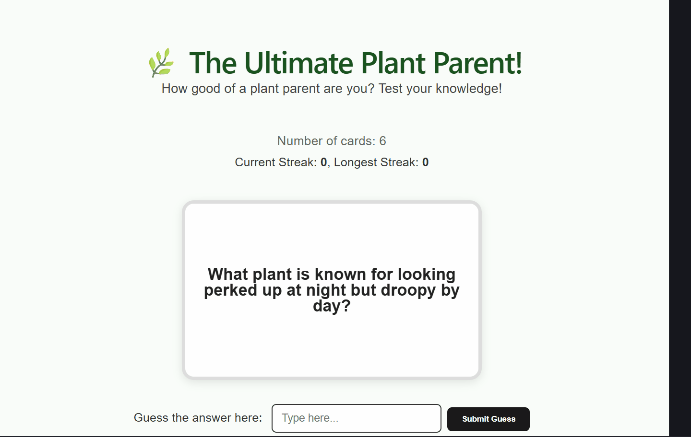

Web Development Project 3 - The Ultimate Plant Parent!
Submitted by: Duban Correa

The Ultimate Plant Parent! is a flashcard-based web application designed to help plant enthusiasts test their knowledge. Users can guess plant-related facts, navigate through a deck of cards, and track their progress through a streak counter.

Time spent: 3 hours spent in total

Required Features
The following required functionality is completed:

[x] The user can enter their guess into an input box before seeing the flipside of the card

[x] Application features a clearly labeled input box with a submit button where users can type in a guess

[x] Clicking on the submit button with an incorrect answer shows visual feedback that it is wrong

[x] Clicking on the submit button with a correct answer shows visual feedback that it is correct

[x] The user can navigate through an ordered list of cards

[x] A forward/next button displayed on the card navigates to the next card in a set sequence when clicked

[x] A previous/back button displayed on the card returns to the previous card in the set sequence when clicked

[x] Both the next and back buttons have visual indications (disabled state) at the beginning and end of the list

The following stretch features are implemented:

[x] Users can use a shuffle button to randomize the order of the cards

[x] A user’s answer may be counted as correct even when it is slightly different from the target answer (Fuzzy Matching)

[x] A counter displays the user’s current and longest streak of correct responses

[x] Card flipping animation using 3D CSS transforms

Video Walkthrough
Here's a walkthrough of implemented required features:

GIF created with ScreenToGif (Windows)

Notes
The biggest challenge encountered during this project was implementing the 3D flip animation while ensuring the "correct" and "wrong" feedback borders still looked clean on the animated container. Additionally, refining the fuzzy matching logic required careful use of JavaScript string methods to ensure common plant names were accepted even if the casing was slightly off.

License
Copyright 2026 Duban Correa

Licensed under the Apache License, Version 2.0 (the "License");
you may not use this file except in compliance with the License.
You may obtain a copy of the License at

    [http://www.apache.org/licenses/LICENSE-2.0](http://www.apache.org/licenses/LICENSE-2.0)

Unless required by applicable law or agreed to in writing, software
distributed under the License is distributed on an "AS IS" BASIS,
WITHOUT WARRANTIES OR CONDITIONS OF ANY KIND, either express or implied.
See the License for the specific language governing permissions and
limitations under the License.